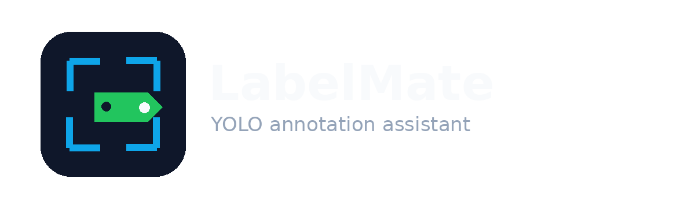
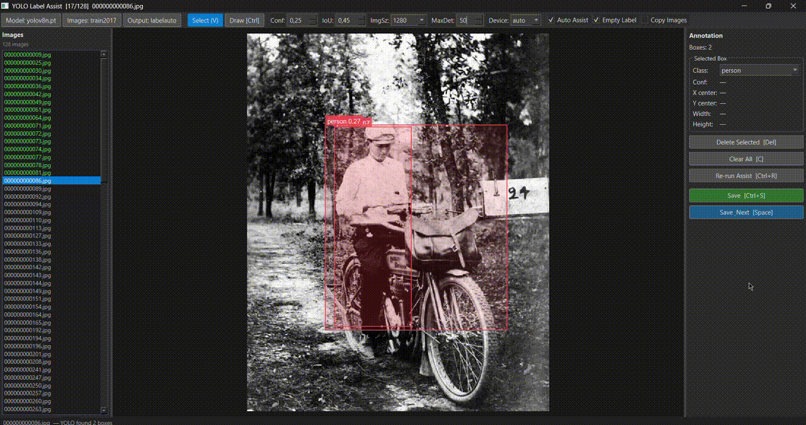

<p align="center">
  
</p>

<p align="center">
  <strong>Your local AI companion for YOLO labeling.</strong><br>
  Fast. Offline. Yours.
</p>

<p align="center">
  
  
  
</p>

---

LabelMate is a desktop annotation tool that combines YOLO inference with an interactive canvas, letting you build YOLO training datasets without any cloud dependency.

> Your local AI companion for YOLO labeling. Fast. Offline. Yours.


LabelMate is a desktop annotation tool that combines YOLO inference with an interactive canvas, letting you build YOLO training datasets without any cloud dependency.

---

## GIF




---

## Features

- **AI-assisted labeling** — load any `.pt` / `.onnx` YOLO model; boxes are proposed automatically
- **Interactive canvas** — draw, move, resize, and delete bounding boxes with mouse or keyboard
- **Zoom & pan** — scroll to zoom, right/middle-click drag to pan
- **Undo / Redo** — full state snapshots, up to 50 steps
- **Image list** with color-coded completion status (green = labeled, gray = unlabeled)
- **Auto Assist** — runs inference automatically when switching images
- **Copy Images** — optionally mirrors source images into the output folder
- **YOLO-format output** — normalized `class_id x_center y_center width height` per line
- **Multi-class support** — class names loaded from `classes.txt`
- **Cross-platform** — Windows / Linux / macOS via PySide6 Fusion theme
- **Non-blocking inference** — model warmup and prediction run in worker threads; UI stays responsive

---

## Installation

```bash
python -m venv venv

# Windows
venv\Scripts\activate

# Linux / macOS
source venv/bin/activate

pip install -r requirements.txt
python main.py
```

**Requirements:** Python 3.9+

---

## Quick Start

1. **Select Model** — pick a `.pt` or `.onnx` YOLO weight file
2. **Images Folder** — choose the folder containing your images
3. **Output Folder** — choose where labels will be saved (`labels/` subfolder is created automatically)
4. The first image opens; LabelMate proposes bounding boxes automatically
5. Accept, delete, resize, or draw boxes as needed
6. Press **Space** to save and move to the next image

### Inference Parameters (toolbar)

| Parameter | Default | Description |
|-----------|---------|-------------|
| Confidence | 0.05 | Minimum detection confidence |
| IoU | 0.45 | NMS IoU threshold |
| Image size | 1280 | Inference resolution |
| Max detections | 50 | Maximum boxes per image |
| Device | auto | `auto` · `cpu` · `cuda:0` |

---

## Keyboard Shortcuts

| Shortcut | Action |
|----------|--------|
| `Space` | Save & Next image |
| `A` / `←` | Previous image |
| `D` / `→` | Next image |
| `R` | Rectangle draw mode |
| `V` / `Esc` | Select mode |
| `Ctrl` (hold) | Temporary draw mode |
| `Delete` | Delete selected bbox |
| `C` | Clear all boxes (with confirmation) |
| `F` | Fit image to screen |
| `Ctrl+S` | Save |
| `Ctrl+R` | Re-run AI Assist |
| `Ctrl+Z` | Undo |
| `Ctrl+Y` | Redo |

---

## Mouse Controls

| Action | Result |
|--------|--------|
| Left-click on bbox | Select |
| Left-drag on empty area (draw mode) | Draw new bbox |
| Left-drag on selected bbox | Move |
| Drag corner / edge handle | Resize |
| Right-click + drag / Middle-click + drag | Pan |
| Scroll wheel | Zoom |

---

## Output Structure

```
output_folder/
├── labels/
│   ├── image001.txt
│   ├── image002.txt
│   └── ...
├── images/          ← only if "Copy Images" is checked
│   └── ...
└── classes.txt
```

**Label file format (YOLO):**
```
<class_id> <x_center> <y_center> <width> <height>
0 0.512300 0.438200 0.034100 0.028900
```

All coordinates are normalized to `[0, 1]`. Confidence scores are not written to label files.

---

## Project Structure

```
labelmate/
├── main.py               # Entry point
├── requirements.txt
└── app/
    ├── settings.py       # Configuration constants
    ├── bbox.py           # BBox data model (normalized coords)
    ├── label_io.py       # Read / write YOLO label files
    ├── utils.py          # Image file scanning, copy helpers
    ├── yolo_inference.py # Ultralytics YOLO wrapper
    ├── workers.py        # QThread workers (inference, warmup)
    ├── canvas.py         # Interactive annotation canvas widget
    └── main_window.py    # Main application window
```

---

## Known Limitations

- Optimized for single-class labeling workflows; multi-class is supported but the default class is `drone`.
- Image folders only — no video file support.
- GPU usage is delegated to Ultralytics (`device: auto`).

---

## License

[MIT](LICENSE) © 2026 malifw
